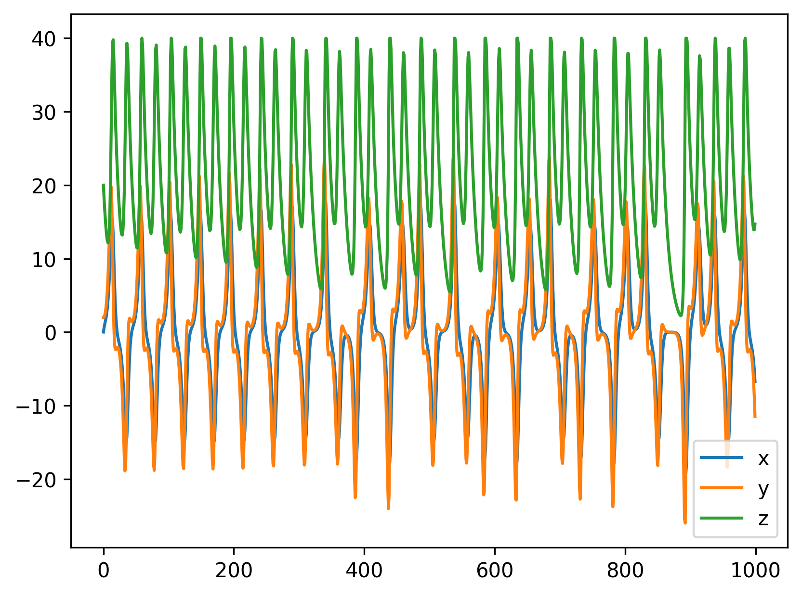
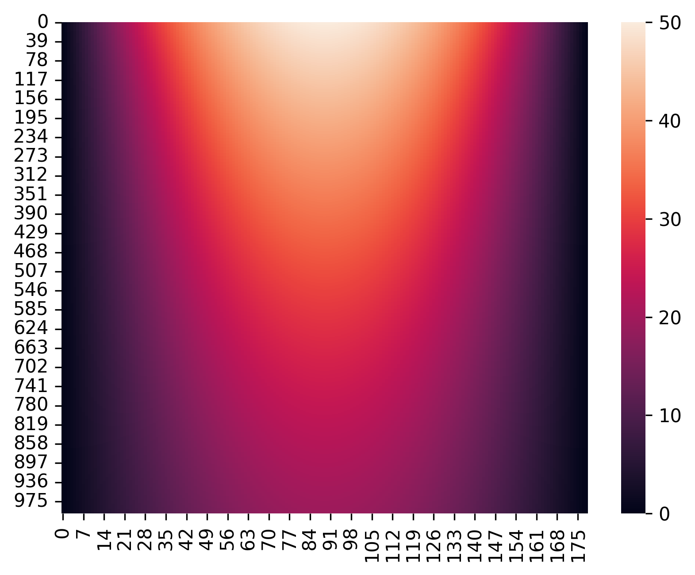
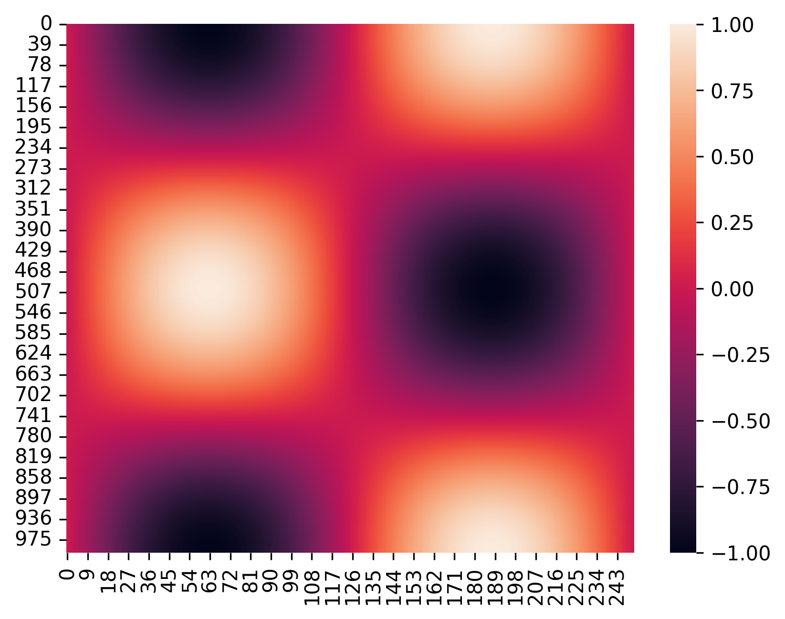

# **PTOC:** PDE to ODE converter

Compiler that converts an input PDE with sufficient boundary conditions to an iterated ODE model. This model should then serve as an input to an analog-digital hybrid computer.

The generated ODE is an approximation of the input PDE, where the spatial dimensions are divided into a hypergrid. Each cell corresponds to part of the output ODE.

## Running the converter

The project can be built using `make` in the base project folder. When running `make`, both a `build` and `tmp` folder are created. The `build` folder will contain the program executable. The program executable will be `build/main`. The `tmp` folder is the dafult output folder for all tools present in PTOC.

### Basic example

Some examples of PDEs in the input specification format are in the [examples](examples/) folder. We will look at the [examples/heat1D.pde](examples/heat1D.pde) example, which converts the one-dimension heat equation on the domain $(-\sqrt{50}, \sqrt{50})$. The initial value is set to $u(0; x) = 50 - x^2$, and the boundary condition is $u(t, -\sqrt{50}) = u(t, \sqrt{50}) = 0$. Read more about the input format in the corresponding [section](#input-format).

Now run the command `build/main examples/heat1D.pde`. This will create a file `tmp/compiler.ode`, which is the appoximation ODE of the input equation. It contains a system of ODEs with 177 equations in total. The first two systems in the output are setup by the converter for solving the large equation.

## Simulating the output ODE

The generated ODE can be simulated using a different tool. Running `build/main --ode tmp/compiler.ode` will simulate the ODE in the `tmp/compiler.ode` file. This will create a file `tmp/ode.csv`, which contains all data from the simulation. There are also examples of smaller ODEs that were not generated from a PDE, present in the [exmaples/ode](examples/ode) folder.

For these smaller examples, a Python script [graphic.py](src/ode/sim/graphic.py) is present, which automatically simulates the given ODE system and creates a graph of all output variables. An example for the [Lorenz equation](examples/ode/lorenz.ode) is shown below. The output of the command `python3 src/ode/sim/graphic.py examples/ode/lorenz.ode` is stored in the `tmp/ode.png` file.



When simulating an ODE that was generated from a one-dimensional PDE, the [heatmap.py](src/ode/sim/heatmap.py) script can be used to create a 2D heatmap output of the simulation. Here the vertical axis represents time (the top is $t = 0$). The horizontal axis represents space. When doing this for the [one-dimensional heat equation](examples/heat1D.pde) the result is shown below. Note that for this to work you first need to run `build/main examples/heat1D.pde`, and then `python3 src/ode/sim/heatmap.py tmp/compiler.ode`. The output stored in the `tmp/heatmap.png` file.



## Input (PDE) format

The input PDE is in the following format:
```
pde {
    option value;
    option value;
    ...
}
```
The following options have to be given to the converter:
| Option | Description |
| --- | --- |
| `dims` | The names of the dimensions can then be used in other expressions, like the domain definition |
| `domain` | Defines a space that is the domain of the PDE, the boundary of this domain is then automatically determined by the compiler |
| `pivot` | A pivot needs to be given that lies inside the domain. The compiler uses this pivot to generate the connected component of the domain that the pivot is contained in |
| `scale` | The scale of each grid cell, which is the same in each dimension |
| `equation` | PDE equations with only time derivatives on the left, and only spatial derivatives on the right. Each variable should correspond with exactly one equation |
| `init` | For each variable, an initial condition should be given for each time derivative up to (but not including) the time derivate in its equation. For example in the equation $\partial_{tt}u = \partial_{xx}u$, the initial values of $u$ and $\partial_{t} u$ need to be given |
| `boundary` | The boundary values at each point in time should be given for each variable. In this case, the boundary values for the derivatives should not be given, as these are determined by the converter |
| `interval` | Should be given for each variable, and all of its derivatives up to (but not including) the time derivative in its equation. This indicates a bound that the solution of the PDE (and resulting ODE approximation) is not expected to exceed |
| `time` |  Simulation time of the PDE |
| `iterations` | The number of iterations to generate approximation ODEs for (see [Iterative model](#iterative-model)) |
| `emit` | `emit` statements indicate that simulation data from a certain variable should be stored somewhere, this data will be gathered when simulating the output ODE |

For examples of PDE specifications see the [examples](examples) folder.

## Output (ODE) format

The output ODE is in a similar format to the input PDE, but with fewer options. Also, the ODE specification files allow multiple systems. A system can use all data from `emit` statements from the previous systems. For an ODE the following needs to be given:
| Option | Description |
| --- | --- |
| `var` | ODE variable, with on the right side of the $=$ sign either an expression in variables that were defined before it, or an integral definition, with initial value of the variable and an expression of the integral |
| `interval` | Should be given for each variable. This indicates a bounds that the solution of the ODE is not expected to exceed |
| `emit` | Store values of a variable for later use |
| `time` | Simulation time of the ODE |

For examples of ODE specifications see the [examples/ode](examples/ode) folder. A more detailed description of the ODE specification format can be found in [docs/ode_format.md](docs/ode_format.md).




## Iterative model

When simulating PDEs with a large domain and therefore a large grid, the analog computer may not be able to simulate all ODEs in the output system at the same time. To combat this, an iterative model can be introduced where the ODEs are solved in groups, and values from outside the group are taken from the previous iteration. The number of iterations the simulation runs for can be set by the user in the input file. By the default, the maximum group size is set to `1000000`. This can be modified with a command-line argument.

## Command-line arguments

For the ODE simulator, the argument `-s[value]` can be given to set the time step size of the simulator. This argument can also be passed to the graphic and heatmap Python scripts.

For the PDE converter, the command line arguments are listed with `build/main -h`.
